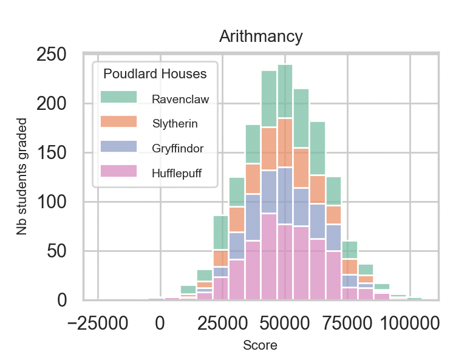
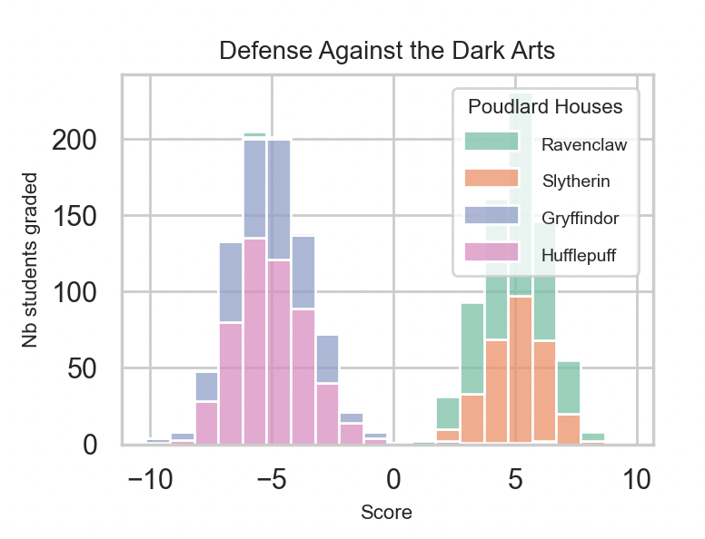

## Rappel :

Run these commands to get started : 

`python3 -m venv dslr_env`   
`source dslr_env/bin/activate`      
`pip install -r requirements.txt`    

## Quelques notions de statistiques utiles :

✅ MEAN : 
La moyenne, la somme des valeurs divisee par le nombre de ces valeurs.

✅ STD ou Ecart-type :
C'est la mesure de dispersion des donnees par rapport a la moyenne de ces donnees.
Plus un STD est grand, plus les donnees son eclatees par rapport a leur moyenne.

✅ Quartiles :
Ils divisent un ensemble de donnees en 4 parties egales : jusqu'a 25%, 50%, 75% et 100%. 
Cela permet d'avoir une idee de la distribution des valeurs du dataset.

# Data Visualisation 

The main librairies for vizualisation are matplotlib (foundation) and seaborn which is built on matplotlib but it is more suited to statistical visualisations and it has great aesthetics. Plus, the syntax is less complex. These are the only ones we use at this point in the project. Pandas has built in plotting but is too simple for what we are being asked to produce. Seaborn used to have a method called distplot() which is now deprecated. The way to create a histogram in seaborn is with histplot(). 

## Which Hogwarts course has a homogeneous score distribution between all four houses? (Histogram)
A histogram is a graphical representation that organizes data into continuous intervals or "bins," displaying the frequency or count of observations within each bin. A great ressource [here](https://www.coursera.org/fr-FR/articles/what-is-a-histogram).

A "homogeneous score distribution" in this case means a distribution whereby of each Hogwart house will be similar (ie the bins will overlap). Below is an example of homogeneous vs non-homogeneous score distribution in two courses at Hogwart.

  
  

## What are the two features that are similar ? (Scatter plots)
A scatter plot allows you to visualize relationships between two variables. Its name comes from the graph's design—it looks like a collection of dots scattered across an x- and y-axis.  A great ressource [here](https://www.coursera.org/articles/what-is-a-scatter-plot).

## pair plot 

