## Usage 

Run these commands to get started :    
- `python3 -m venv dslr_env`     
- `source dslr_env/bin/activate`        
- `pip install -r requirements.txt`      

## Provided dataset 

A Hogwarts student dataset with the following columns, splitted into two categories:

* Student information: Index, Hogwarts House, First Name, Last Name, Birthday, Best Hand

* Course scores: Arithmancy, Astronomy, Herbology, Defense Against the Dark Arts, Divination, Muggle Studies, Ancient Runes, History of Magic, Transfiguration, Potions, Care of Magical Creatures, Charms, Flying

The main librairies for vizualisation are matplotlib (foundation) and seaborn which is built on matplotlib but it is more suited to statistical visualisations and it has great aesthetics. Plus, the syntax is less complex. Pandas has built in plotting but it is too simple for what we are being asked to produce.

## Data Visualisation
 
We start by calculating the statistics of our preprocessed dataset which can be found in `output/describe/statistics.csv`. 
Some useful statistical concepts:

✅ MEAN: The average — the sum of all values divided by the number of values.   
✅ STD or Standard Deviation: A measure of how spread out the data is around the mean. A higher standard deviation means the values are more dispersed from the average.   
✅ QUARTILES: Three values that split sorted data into four parts, each with an equal number of observations Quartiles & Quantiles | Calculation, Definition & Interpretation. Specifically:   
- Q1 (First quartile): The 25th percentile, meaning that 25% of the data falls below the first quartile Quartiles & Quantiles | Calculation, Definition & Interpretation
- Q2 (Second quartile/Median): The 50th percentile, meaning that 50% of the data falls below the second quartile Quartiles & Quantiles | Calculation, Definition & Interpretation
- Q3 (Third quartile): The 75th percentile, meaning that 75% of the data falls below the third quartile Quartiles & Quantiles | Calculation, Definition & Interpretation
✅ MAX: The largest value in the dataset.
✅ COUNT NaN: The number of missing or null values in each column.
✅ PERCENT NaN: The percentage of missing values relative to the total dataset size.
✅ VARIANCE: The average of the squared differences from the mean. It measures variability in the data (standard deviation squared).
✅ RANGE: The difference between the maximum and minimum values (Max - Min).

<h5 style="display: inline; margin: 0;" >CSV File tip</h5>
   

Download the extension "Rainbow CSV" and at the bottom of the IDE there's a clickable addon **align** so you can visualise them better. Don't forget to remove it and switch it back to **shrink** as it will invalidate any further parsing (it adds spaces). Shrink vs Align : 

  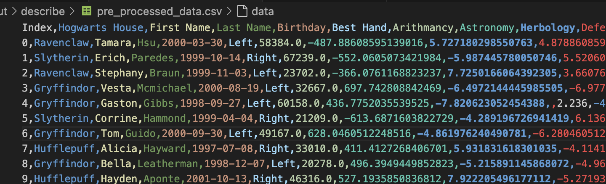
  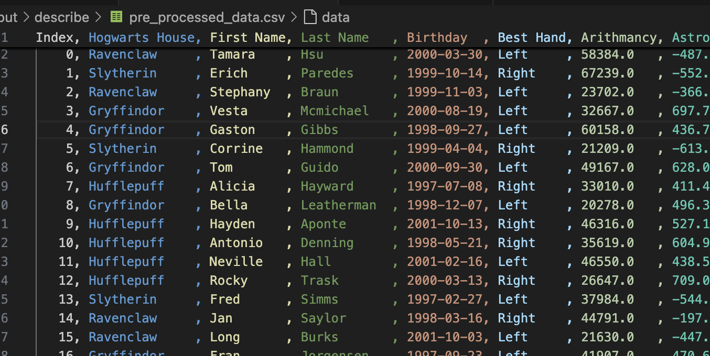

  

<h4 style="display: inline; margin: 0;"> 1. Which Hogwarts course has a homogeneous score distribution between all four houses? (Histogram)</h4>

A histogram is a graphical representation that organizes data into continuous intervals or "bins," displaying the frequency or count of observations within each bin. A great ressource [here](https://www.coursera.org/fr-FR/articles/what-is-a-histogram).

A "homogeneous score distribution between all four houses" means the score distributions are similar across all houses. This is actually the *opposite* of what we want for effective classification. For good classification, we want features where each house shows distinct patterns.

SOLUTION 1 : Simple histogram

Firstly, we simply generated a histogram using seaborn. We get the following which displays quite obvisouly courses in which students' grades are homogeneous vs non-homogenous : 

  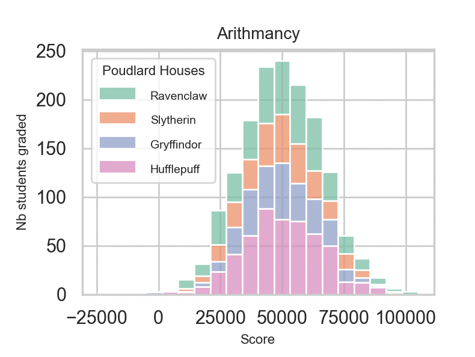
  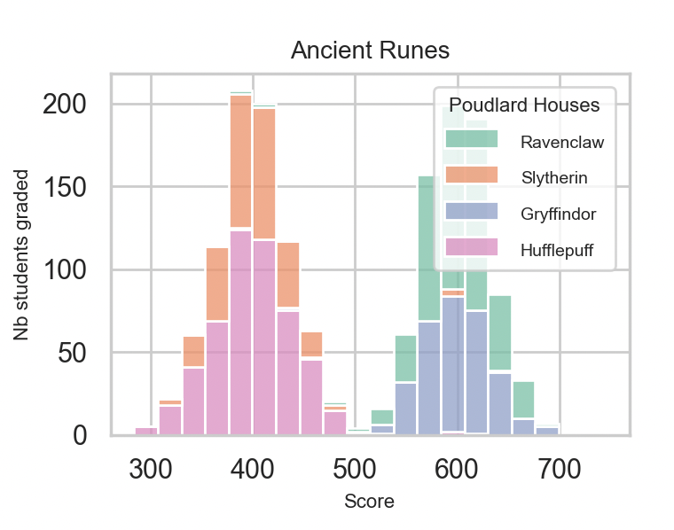

Tried something by preprocessing Birthday and Best Hand but it is too homogeneous to be relevant. 

  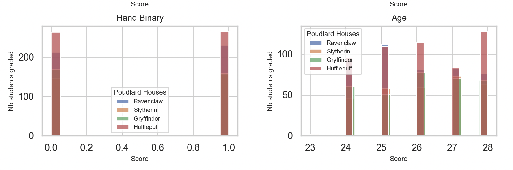

SOLUTION 2 : Use F-RATIO, a homogeneity metric 

- Between-Group Variance: Measures how different the house means are from each other for a given course. Higher values indicate greater differences between houses.
- Within-Group Variance: Measures how much scores vary within each house. Lower values indicate more consistency within houses.
- F-ratio: between-variance ÷ average within-variance 

The course with the lowest F-ratio would be considered the most homogeneous, as this indicates minimal differences between houses relative to the variation within houses.

 An example that explains F-Ratio 

Scenario 1:

Course A: House means are [70, 72, 73, 71]
Between-group variance = 1.5
Every student in each house gets nearly identical scores (within-group variance ≈ 0)

Scenario 2:

Course B: House means are also [70, 72, 73, 71]
Between-group variance = 1.5 (same as Course A)
Scores within each house vary wildly from 40-100 (within-group variance = 225)

Both courses have identical between-group variance, but they tell completely different stories:

In Course A, the houses truly perform differently (the small differences are meaningful)
In Course B, the houses aren't meaningfully different because the within-house variation dwarfs the between-house differences

The F-ratio as a Solution
The F-ratio (between-variance ÷ within-variance) solves this by contextualizing the between-group differences:

Course A: F-ratio = 1.5 ÷ ~0 = very high → truly heterogeneous
Course B: F-ratio = 1.5 ÷ 225 = 0.0067 → actually homogeneous

Low F-ratio: Indicates similar means across houses with similar internal variations (homogeneous)
High F-ratio: Indicates significant differences between houses (heterogeneous)

  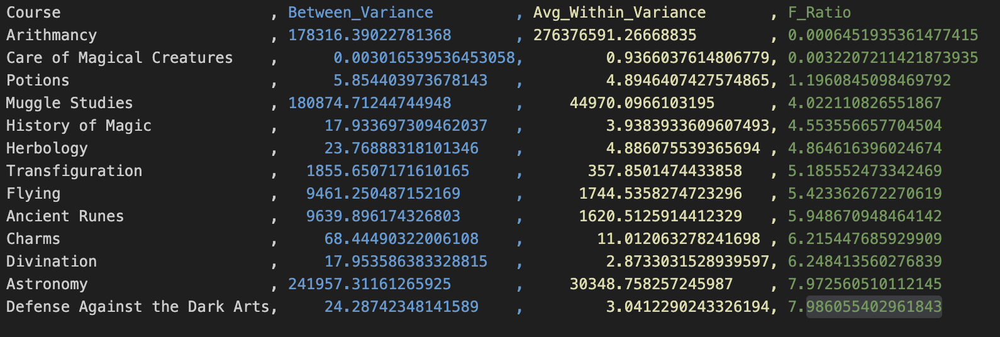

 

<h4 style="display: inline; margin: 0;"> 2. What are the two features that are similar ? (Scatter plots)</h4>

A scatter plot allows you to visualize relationships between two variables. Its name comes from the graph's design—it looks like a collection of dots scattered across an x- and y-axis. A great ressource [here](https://www.coursera.org/articles/what-is-a-scatter-plot).

The correlation coefficient measures the statistical relationship between two variables. We use corr() on our dataset (only on the numeric values) to find which subjects are closest. The corr() function in pandas computes pairwise correlation between columns, returning a correlation matrix that shows how each variable relates to every other variable. Range of Values:

+1.0: Perfect positive correlation (as one variable increases, the other increases proportionally)
0: No correlation (variables are independent)
-1.0: Perfect negative correlation (as one variable increases, the other decreases proportionally)

By default, it uses Pearson correlation, which measures linear relationships between variables. Tried the other methods but the most "definite" one for our values is Pearson. We notice in some courses, one house is very separate from the rest. We see a perfect negative correlation : 

  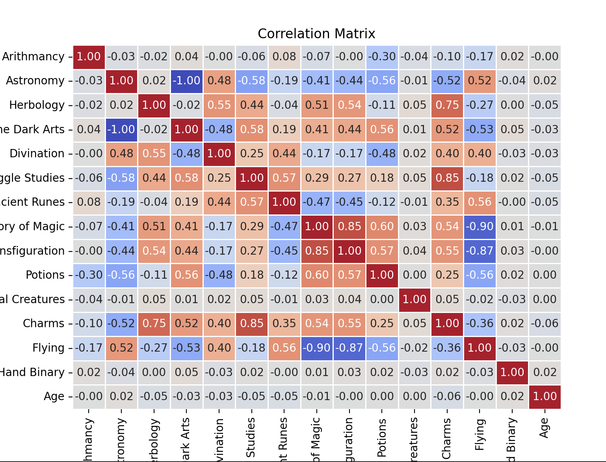

  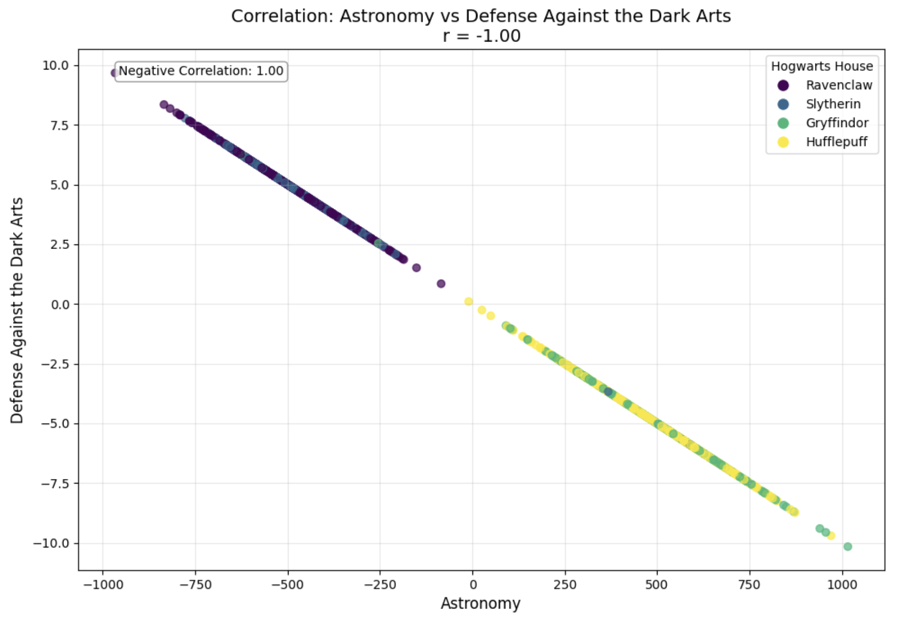

 

<h4 style="display: inline; margin: 0;">  3. From this visualization, what features are you going to use for your logistic regression? (Pair plot) </h4>
 

We can see here that interesting features are Herbology for example which allows us to really distinguish students from different houses. 

  

 
    
    
## Logistic Regression One-vs-All    

<h3 style="display: inline; margin: 0">Overview</h2>

  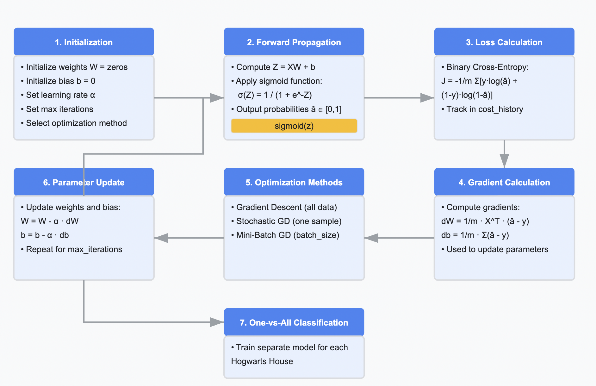

Inherently, machine learning models are binary classifiers. Logistic regression is a supervised machine learning algorithm used for classification tasks where the goal is to predict the probability that an instance belongs to a given class or not.

The One-Versus-All (OvR) method decomposes a multi-class problem into multiple binary classification tasks, where each class is trained against all others using logistic regression.

  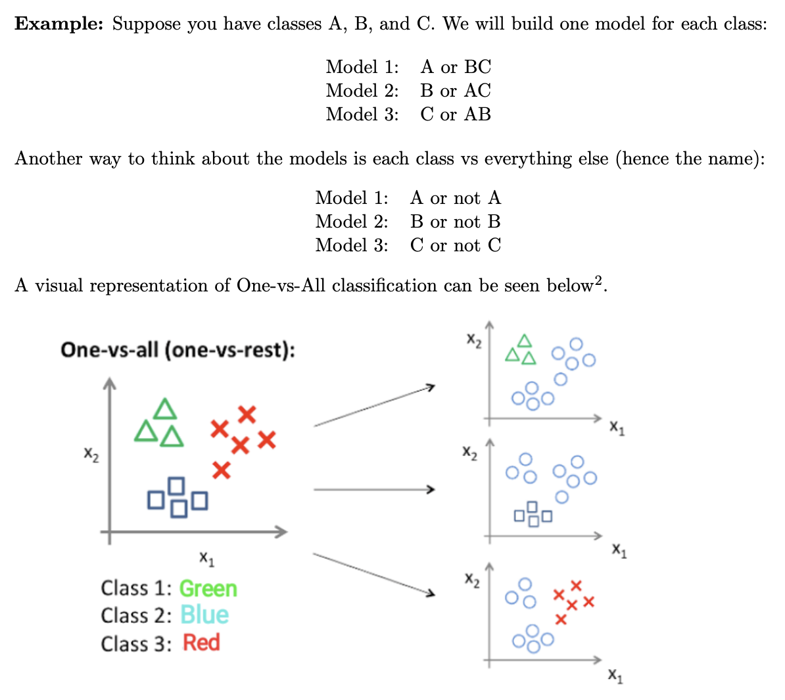

**The issue at hand : to which Hogwart house does the student belong ?**

So in our case, there are 4 different "classes" which corresponds to the 4 different Hogwarts houses : Gryffindor, Hufflepuff, Ravenclaw, Slytherin. So N = 4, and we'll need to train 4 independent classifiers.

<h3 style="display: inline; margin: 0;"> Step by Step </h2>

<h4>Standardizing our data</h4>

Standardization is a preprocessing technique used in machine learning to rescale and transform the features (variables) of a dataset to have a mean of 0 and a standard deviation of 1. For each data point (sample), subtract the mean (μ) of the feature and then divide by the standard deviation (σ) of the feature. 

 Standardized value = x − μ / σ

<h4>Train each binary classifier</h4>

Logistic regression is a widely used model in machine learning for binary classification tasks. It models the probability that a given input belongs to a particular class. To train a logistic regression model, we aim to find the best values for the parameters (w,b) that best fit our dataset and provide accurate class probabilities.     

The training process involves iteratively updating the weight vector (w) and bias term (b) to minimize the cost function. This is typically done through an optimization algorithm like gradient descent. The logistic regression model function is represented as:     

fw, b(x) = g(w * x + b)   

- fw,b(x) : represents the predicted probability     
- w : is the weight vector    
- b : is the bias term    
- x : is the input feature vector       
- g(z) : is the sigmoid function     

The Sigmoid activation function is as follows :    

g(z) = 1 / (1 + e)^−z

<h3> Loss : Cross entropy </h3>

In general, a loss function is a mechanism to quantify how well a model’s predictions match the actual outcomes, rewarding the model for assigning higher probabilities to correct answers. With CEL : 

- The more confident the model is in predicting the correct outcome, the lower the loss.
- The more confident the model is in predicting in the wrong outcome, the higher the loss.

For example, suppose we have a three-class classification problem (e.g., classifying an image as a dog, cat, or bird). For a single sample with True label: [1, 0, 0] (the correct class is “dog”).

- Predicted probabilities: [0.7, 0.2, 0.1] (70% confident it’s a dog, 20% cat, 10% bird)
- The CLE is around **0.357**

If the model had been more confident the loss would be lower:
- Predicted probabilities: [0.9, 0.05, 0.05],
- The CLE is around **0.105**

Conversely, if the model had predicted incorrectly with high confidence, the loss would be much higher:
- Predicted probabilities: [0.1, 0.8, 0.1]
- The CLE is around **2.303**

Our predictions usually come in the form of logits — raw, unnormalized outputs from the last layer of a neural network — which are essentially a linear combination of the inputs to our final layer, so don’t have a probabilistic interpretation.

To convert these into probabilities, it is common to apply the SoftMax function which preserves the relative ordering of the inputs and amplifies differences between large inputs, whilst ensuring the outputs sum to 1. Importantly, due to the normalization in the denominator, increasing one logit (and its corresponding probability) decreases the probabilities of other classes. This property aligns with our intuition that as a model becomes more confident in one class, it should become less confident in others.

  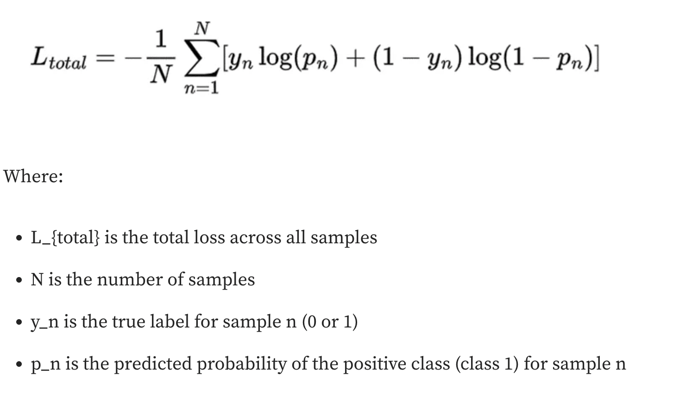

<h3> Optimization </h3>

The optimizers determine how the weights of the machine learning model are updated during backpropagation.

  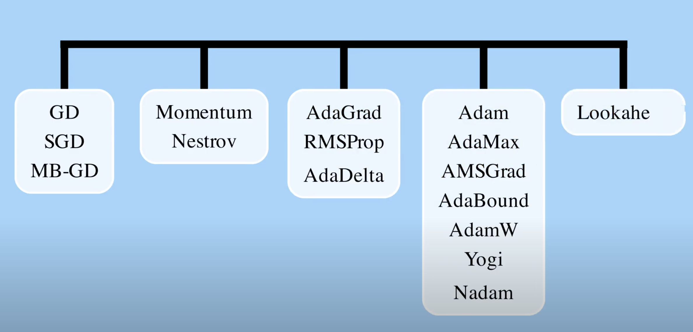

<h1> GD FAMILY </h1>

The gradient descent family of optimizers is one whereby our algorithm takes small steps on the steepest direction until reaching the lowest point. The goal is to find a set of parameters w* that minimizes the prediction cost f(w). 

> Gradient Descent (GD) is an optimization algorithm for finding the optimal parameters of the model by iteratively updating them along the steepest direction of the loss landscape according to f(x). The drawback remains slow convergence / small updates in regions with gradual slope. 

1. Gradient Descent / Batch Gradient Descent    
Gradient Descent, often called "Batch Gradient Descent," uses the entire dataset to compute the gradient at each iteration. So we go through all the training samples and we calculate cumulative error. Then we back propagate and we adjust the weights. This is good for small training sets. If we had 10 million data points, we'd have to do a forward pass on 10 million samples per feature on each epoch. -> Use **all** training samples for one forward pass and then adjust the weights. This is inefficient if we have a large training set with regular GD every update requires computing gradients for an entire dataset. T

2. Stochastic Gradient Descent   
The trick in this case is to compute the Stochastic Gradient Descent which uses just one randomly selected training example to compute the gradient at each iteration. Ressource [here](https://www.youtube.com/watch?v=vMh0zPT0tLI&t=8s). It's quite useful here to accelarate the process, and because we have lots of redundancy in the data (clusters). -> Use **one** randomly picked sample for a forward pass and then adjust the weights.

3. Mini Batch Gradient Descent    
If you want to take advantage of vector maths and use more data points on each iteration, you can pass x random batches instead one sanmple. Mini-Batch Gradient Descent uses small random batches of training examples to compute gradients. -> Use **a batch of** randomly picked samples for a forward pass and then adjust the weights.

<h1> Momentum-based optimizers </h1>

1. Momentum optimizer    
This extends SGD by accelerating training in regions where we are descending (like a ball in physics gaining momentum). The loss takes larger steps.

2. Nestrov optimizer     
Same update rule as the momentum optimizer but instead of computing the gradients using the current weights, it uses a "look ahead approach" (Nestrov Accelrated Gradients, NAG). It outperforms SGD and the classical momentum. It tries to fix the "overshooting" minima extra steps momentum has to take.  

To implement these, we will use Torch and Tensorflow.

  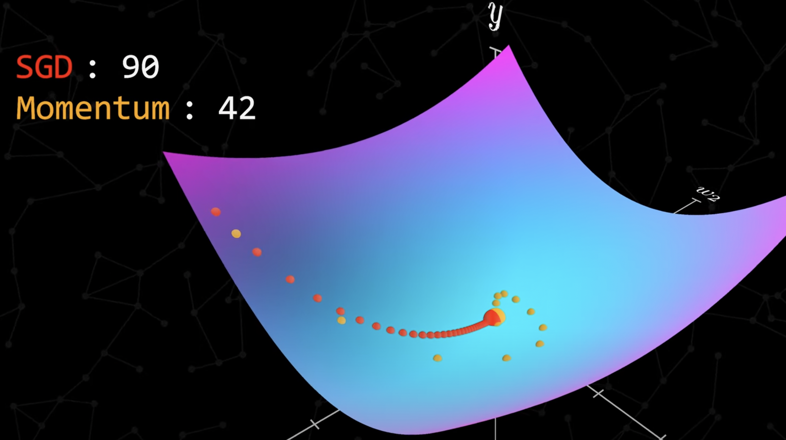

<h1> Adaptive Moment Optimizers (Adam) family optimizers </h1>

A mix of both the above (SGD + Momentum). Today, it's SOTA for machine learning models' optimizers. 

1. Adam  
2. AdamW   

  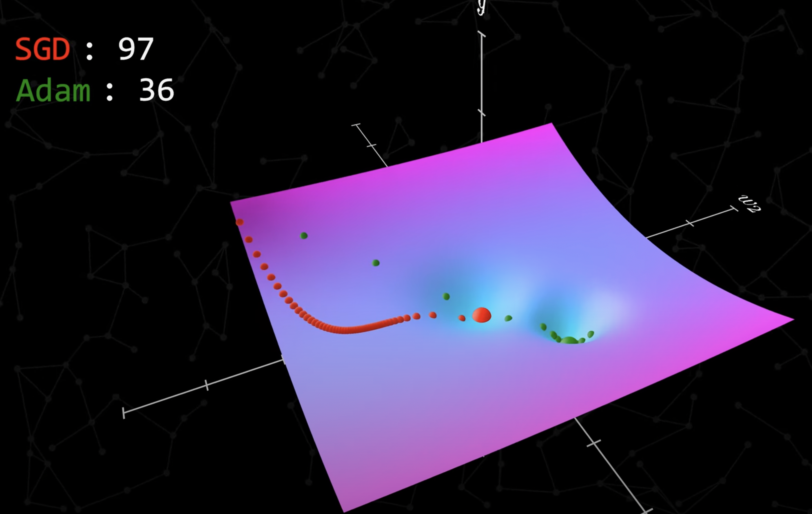

A comparaison of them all [here](https://medium.com/@amannagrawall002/batch-vs-stochastic-vs-mini-batch-gradient-descent-techniques-7dfe6f963a6f).

## Quick overview of the Linear Regression and Logistic Regression methods : 

📈 Linear Regression   

Goal	: Predict a continuous value (e.g., price, temperature)   
Output	: A real number (e.g., 4.2, 101.7)   
Model function	: A linear function: `y = θ₀ + θ₁x`   
Error metric	: Mean Squared Error (MSE), MAE, etc.   
Example	: Predicting a house price based on its size   

📊 Logistic Regression   

Goal	: Predict a probability of class membership (e.g., yes/no, 0/1)   
Output	: A probability between 0 and 1   
Model function	: A sigmoid function: `σ(z) = 1 / (1 + e^(-z)), where z = θ₀ + θ₁x`  
Error metric	: Log-loss (cross-entropy loss)  
Example	: Predicting whether a student is admitted (1) or not (0) based on their score  
LogReg is then the best approach to handle a multiclass binary classification task like this Hogwarts Hat problem !   

